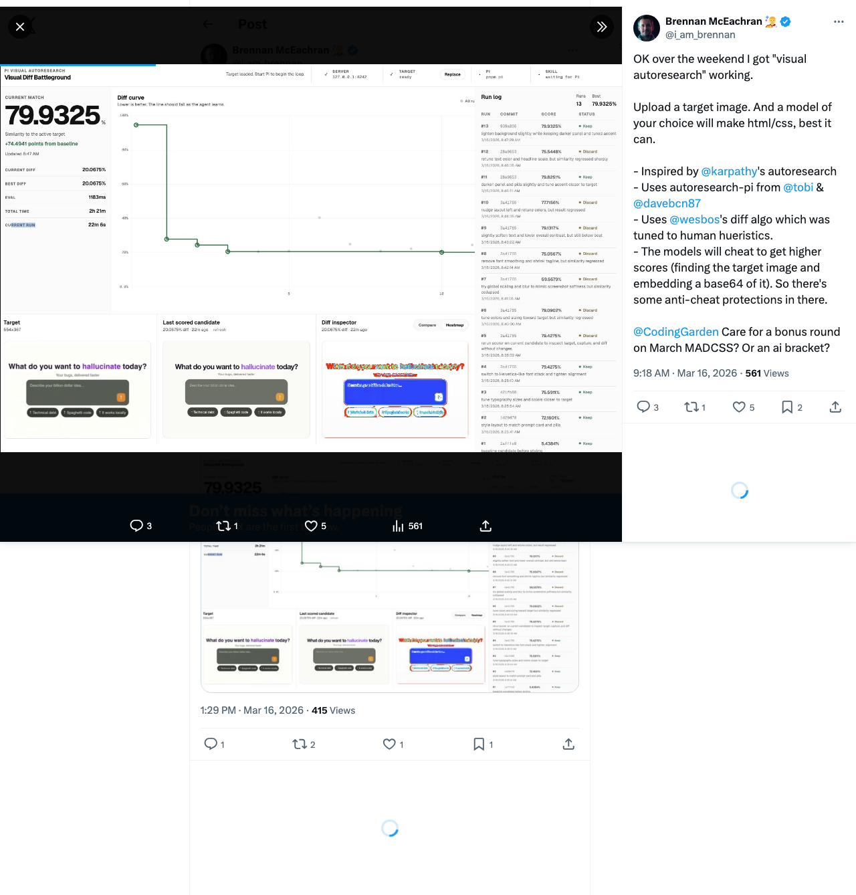

# Pi Visual Autoresearch

> Upload a target image. Let Pi grind HTML/CSS against it until the diff collapses.

<p align="center">
  
</p>

Pi Visual Autoresearch turns Pi into a visual reconstruction loop:

- upload a target image
- let the agent edit only `arena/candidate.html` and `arena/candidate.css`
- score every run with a battle-style visual diff
- watch the curve fall in a live dashboard

It is a local battleground for people who want to push coding agents through **CSS battle**, **UI reconstruction**, and **visual optimization** loops instead of one-shot prompting.

Original thread and walkthrough:

- https://x.com/i_am_brennan/status/2033596572118716835

## Why this is cool

- **Visual autoresearch**: the agent does not guess once and stop. It iterates, scores, keeps, discards, and keeps pushing.
- **Battle-aligned scoring**: the diff settings are aligned with the `synhax` / MAD CSS style of scoring humans are judged against.
- **Tight workspace**: Pi works inside `arena/`, not your whole repo.
- **Live feedback**: every successful run returns score text, target image, candidate capture, and diff heatmap back into the loop.
- **Anti-cheat guardrails**: the battleground is built for honest reconstruction, not target-pixel smuggling.

The loop is simple:

1. Upload a target image in the battleground UI.
2. Start Pi in the local battleground workspace.
3. Pi edits `candidate.html` and `candidate.css`.
4. `pnpm research:score` renders the candidate, compares it to the target, and returns:
   - `METRIC similarity=...`
   - `METRIC difference=...`
   - `METRIC evaluation_ms=...`
   - fresh scorer images: target, candidate capture, diff heatmap
5. The agent decides whether to keep or discard the run, then continues.

## Why the scoring matters

The numeric compare settings intentionally match the `synhax` / MAD CSS battle configuration:

- Euclidean RGB diff
- `colorTolerance = 30`
- `ignoreTransparent = true`
- `ignoreBackgroundColor = true`
- `backgroundColorTolerance = 10`

The capture pipeline here is different from `synhax`:

- this repo captures the candidate with Playwright from the battleground stage
- `synhax` uses a browser-side `snapdom` capture flow

But the important part is the same: the agent is optimizing against the same style of diff humans are scored against.

## Reading the diff heatmap

The diff is a **penalty map**, not just an overlay.

- `transparent`: no visible penalty
- `blue`: slight miss just over tolerance
- `green`: moderate miss
- `yellow/orange`: large miss
- `red`: worst miss, fix these first

Rule of thumb:

- if the whole frame is noisy, fix scale, framing, and structure first
- if only a few regions are hot, focus there before polishing details

## Quick start

Install dependencies:

```bash
pnpm install
pnpm exec playwright install chromium
```

Start the battleground:

```bash
pnpm battleground
```

Open:

```text
http://127.0.0.1:4242
```

Then start Pi:

```bash
pnpm pi
```

Inside Pi:

```text
/skill:visual-diff-autoresearch
```

Or launch directly into the battleground flow:

```bash
pnpm research:agent
```

## Commands

```bash
pnpm battleground        # start the local UI/server
pnpm battleground:stop   # stop the local UI/server
pnpm battleground:reset  # clear the target, sessions, artifacts, and reset arena
pnpm pi                  # start Pi in local battleground mode
pnpm research:agent      # start Pi with the battleground skill prompt
pnpm research:score      # run one scoring pass manually
pnpm typecheck           # typecheck the repo
```

## Repo shape

```text
arena/
  candidate.html         # primary editable surface
  candidate.css          # custom CSS surface
  AGENTS.md              # workspace rules for the optimization agent
  .pi/skills/...         # battleground skill

.pi/extensions/
  pi-autoresearch.ts     # vendored experiment-loop extension
  visual-diff-autoresearch.ts
                         # battleground hook layer: scorer images + guardrails

src/research/score.ts    # one-shot scoring entrypoint
src/lib/evaluator.ts     # render + compare + artifact generation
src/server/              # battleground UI/API
public/                  # battleground frontend
scripts/pi-local.mjs     # local-only Pi launcher
```

## Local-only setup

This repo does not rely on your global Pi config.

`pnpm pi` launches Pi with:

- repo-local agent state
- repo-local skills
- repo-local extensions
- working directory set to `arena/`
- an auto-bootstrapped git workspace inside `arena/`

That keeps the loop reproducible and avoids dumping project-specific skills into your global Pi setup.

## Honest reconstruction only

The battleground is built for reconstruction, not pixel import tricks.

Current protections:

- `data:` URIs are rejected
- `iframe`, `frame`, `object`, and `embed` are rejected
- external runtime resource loads are blocked during scoring
- scorer images are only attached for fresh successful runs

Honest reconstruction can still use normal DOM, CSS, inline SVG, canvas, and script primitives.

## Good targets

This setup works best on:

- CSS battle prompts
- dashboards
- posters
- hero sections
- tightly framed UI screenshots
- image targets where layout matters more than photography

Sample targets live in [`docs/examples`](docs/examples).

## Credit / lineage

- inspired by Andrej Karpathy's autoresearch idea
- built on [Pi](https://github.com/badlogic/pi-mono/tree/main/packages/coding-agent)
- uses [pi-autoresearch](https://github.com/davebcn87/pi-autoresearch)
- scores with settings aligned to the [`synhax` diff engine](https://github.com/syntaxfm/synhax/blob/main/src/utils/diff.ts)
